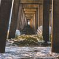

# Titulek

Nějaký text

<!-- Pozor, je třeba oddělit potenciální obsah v Markdownu prázdnými řádky, obrázky doporučuji načítat markdownem, nikoliv HTML -->
<full-width color="#6a0000">

  

</full-width>