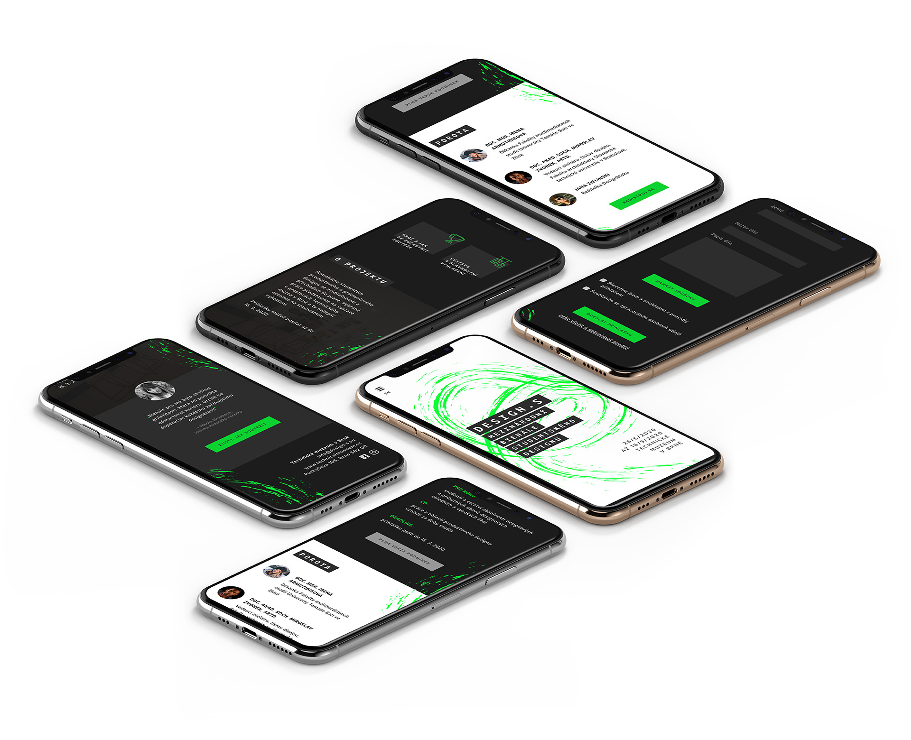
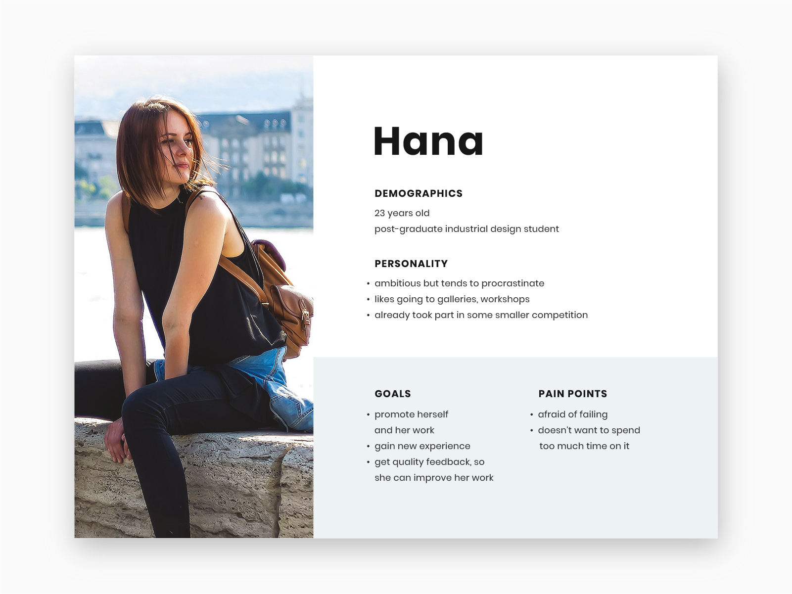

# Biennial of Student Design: DESIGN.S

<full-width color="#dddddd">

  

</full-width>

## Overview

DESIGN.S is a biennial __international event which supports students of industrial and product design__. Every two years, they entirely change visuals to appear modern and attractive to young people. While their visuals use to be eye-catching and work well, their web was confusing, hard to read or scan, and overall didn't look appealing. So I decided to change it!

### Design Goals
* encourage students to participate in the event
* make it easy to find relevant information
* inform and invite public
* create an attractive visual identity

### My Responsibilities
* UX Analysis _(persona, flows)_
* Design _(UI design, visual identity)_
* Prototyping _(low to high fidelity)_

## User Research
To understand better for whom I'm designing, I conducted a couple of interviews with a target group (industrial design students). Based on that, I made a persona you can view below.

## User Experience

### User Journey

### Information Architecture

### User Flow with Blockframes

<full-width color="#212223">

</full-width>

## User Interface

Moodboard, přehled barev a fontů, gif

## Reflection
