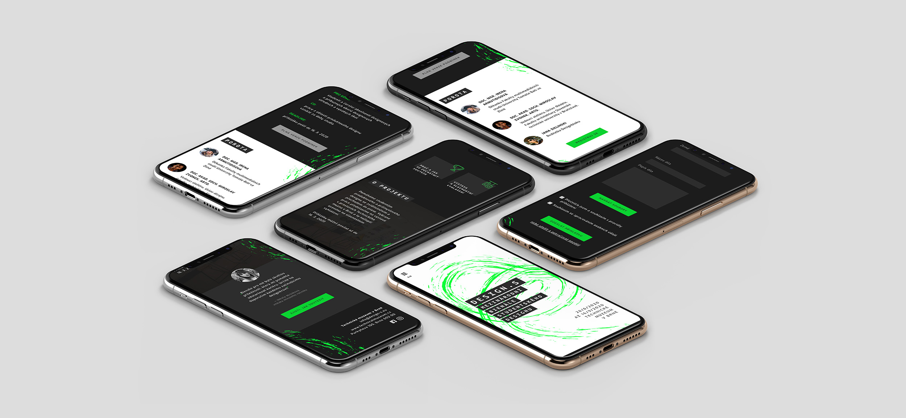
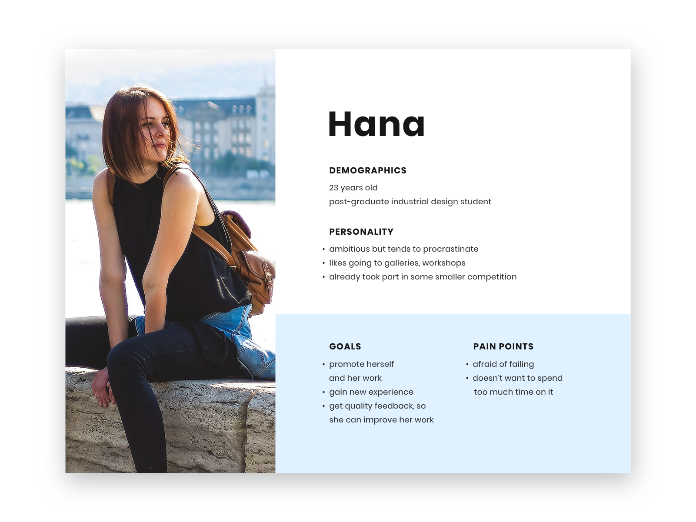
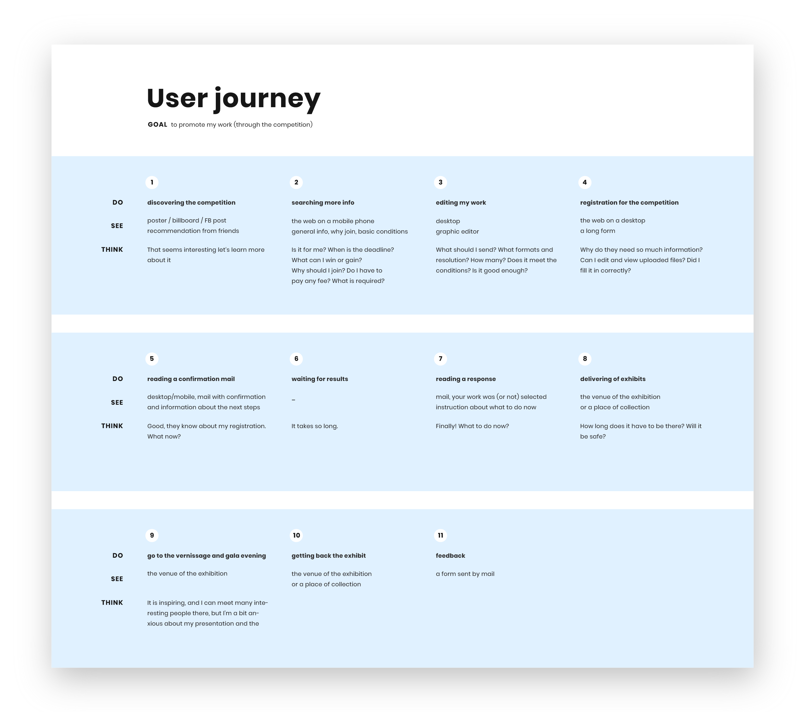
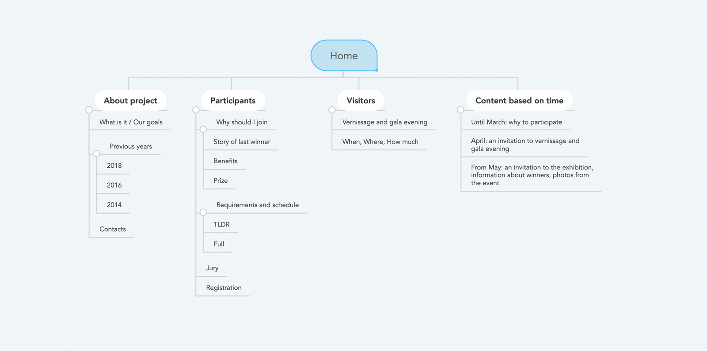
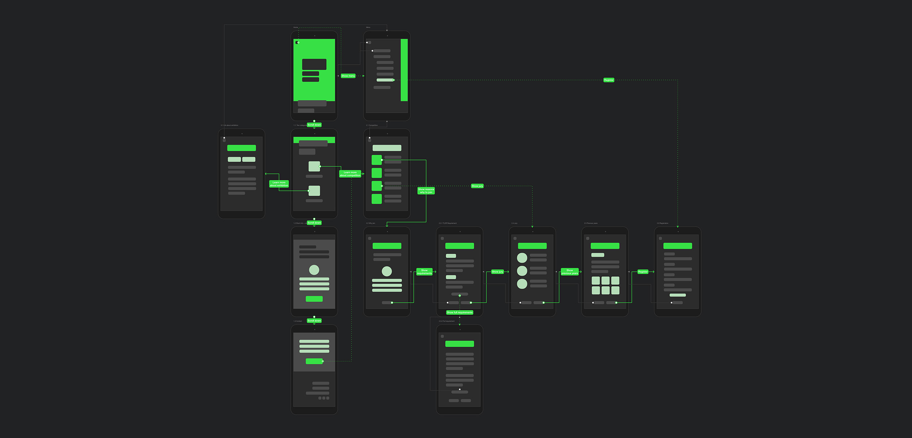
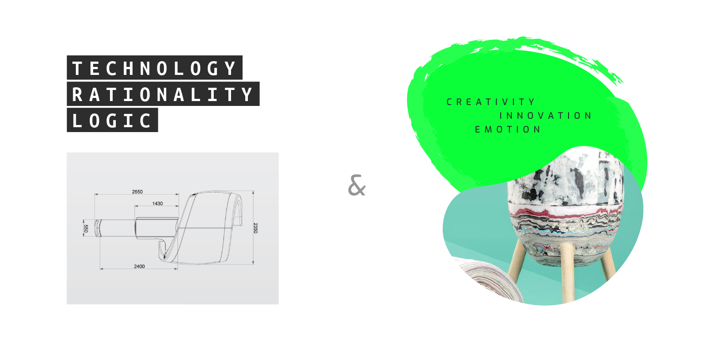
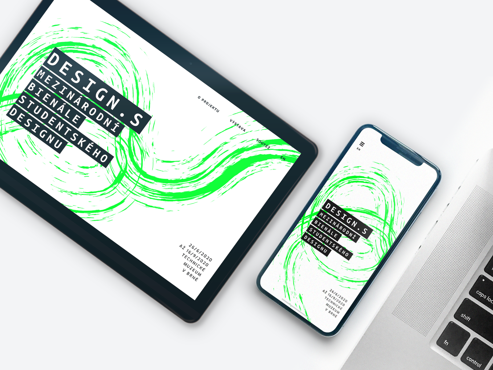
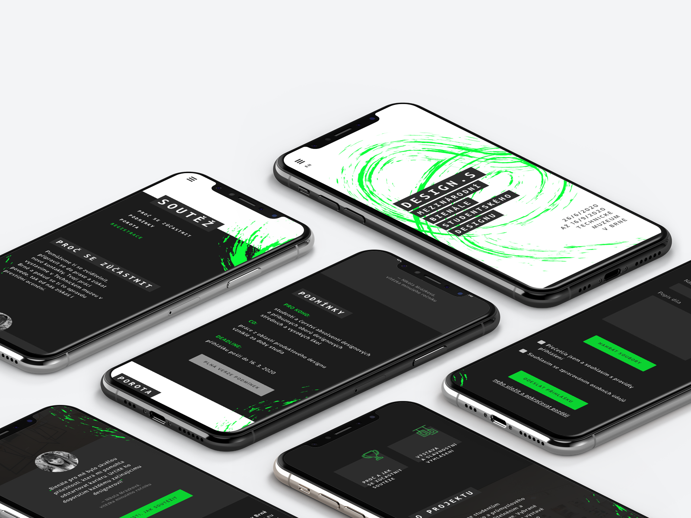

# Biennial of Student Design: DESIGN.S

<full-width color="#dddddd">

  

</full-width>

## Overview

DESIGN.S is a biennial <b>international event (and design competition) which supports students of industrial and product design</b>. Every two years, they entirely change visuals to appear modern and attractive to young people.

While their visuals use to be eye-catching and work well, their web was confusing, hard to read or scan, and overall didn't look appealing. So I decided to change it!

### Design Goals
* encourage students to participate in the competition
* make it easy to find relevant information
* inform and invite public
* create an attractive visual identity

### My Responsibilities
* UX Analysis _(persona, flows)_
* Design _(UI design, visual identity)_
* Prototyping _(low to high fidelity)_

## User Research
To understand better for whom I'm designing, I conducted a couple of interviews with a <b>primary</b> target group (industrial design students). Based on that, I made a persona you can view below.

<b>Secondary</b>, there is another target group – the visitors to the exhibition. These are usually man and woman from 20 to 50 years old with interest in art and design.

## User Experience

### User Journey
Using the persona and the competition schedule, I created a user journey. It helped me a lot to understand, when and in which context the web will be used.

The main decisions I made thanks to this journey are:

* the web will be <b>mobile-first</b>
* the content on the homepage will be changing in time because <b>the goal of the web is changing in time</b>

And what are these goals?

* <b>until March:</b> to inform students about the event and motivate them to join
* <b>March to May:</b> to invite the public to vernissage and gala evening
* <b>from May:</b> to invite the public to the exhibition, inform about winners

The secondary target group (visitors) has less complex needs, and in this case, it will be enough for them to find essential information such as what is it, where is it, when is it and how much is an entrance fee.

### Sitemap

From the current website and the user journey, I gathered all the information that should appear on the web. Then I put them in three categories – general info about the project, section for visitors and section for (potential) participants.

I also chose when and which content will be displayed on the homepage based on the current goals of the website.

### User Flow

With the help of sitemap, I designed a user flow showing how you can navigate through the web's content. In this phase, I used simple blockframes and thought about the layout and position of various elements.

<full-width color="#212224">

</full-width>

## User Interface

## Prototype

<iframe class="iframe_mobile" width="476" height="900" src="//invis.io/BVQOF9V4FM9" frameborder="0"></iframe>

## Reflection
