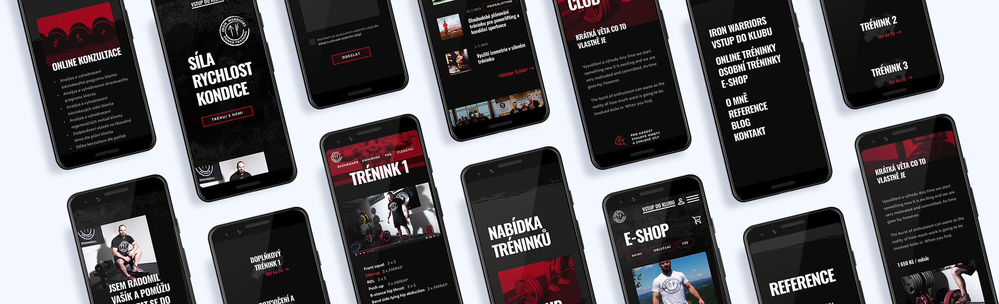
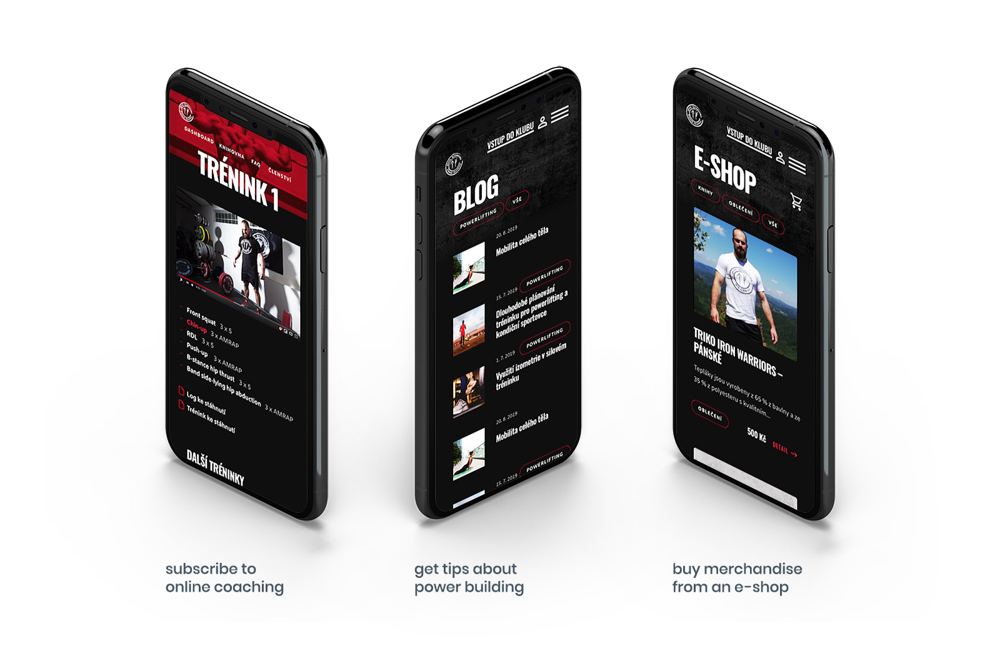
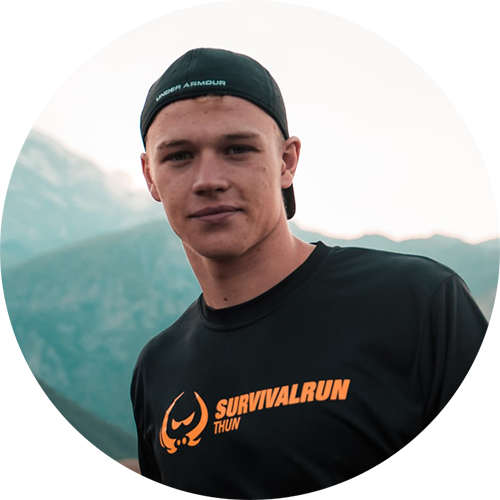
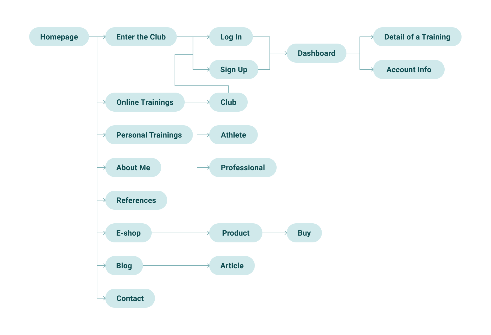
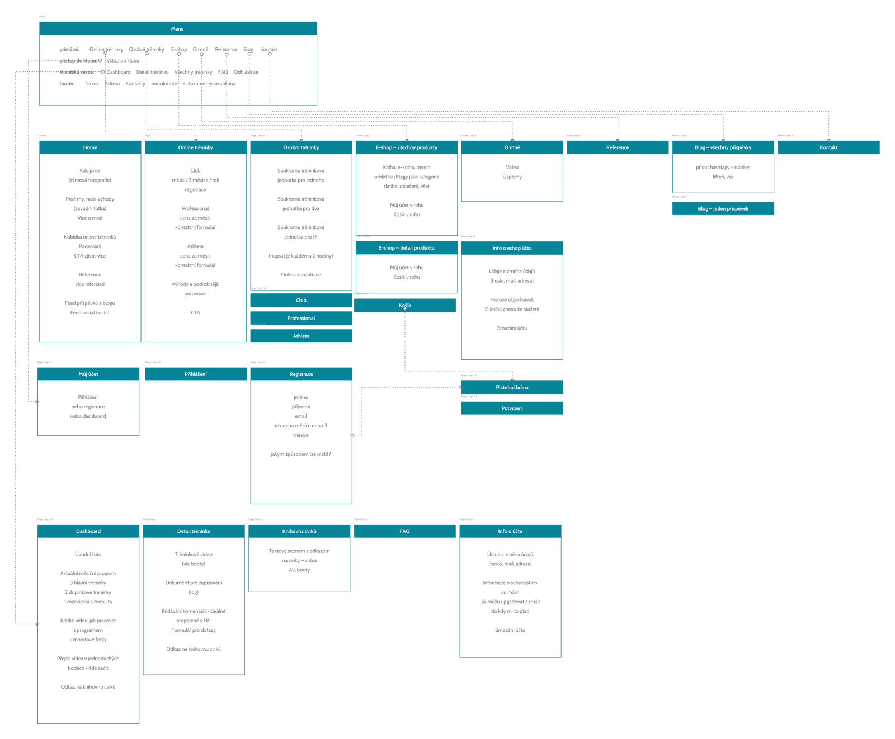
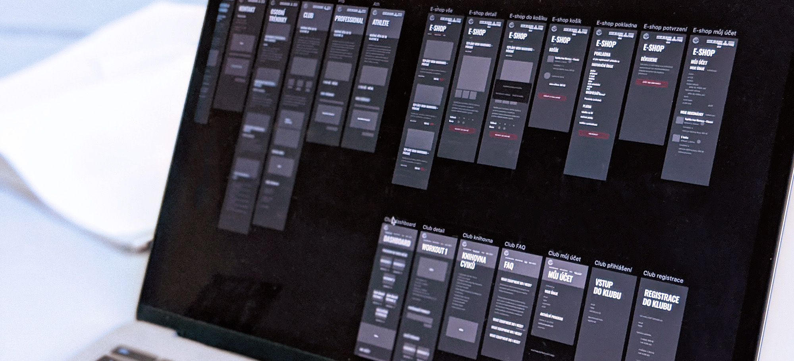
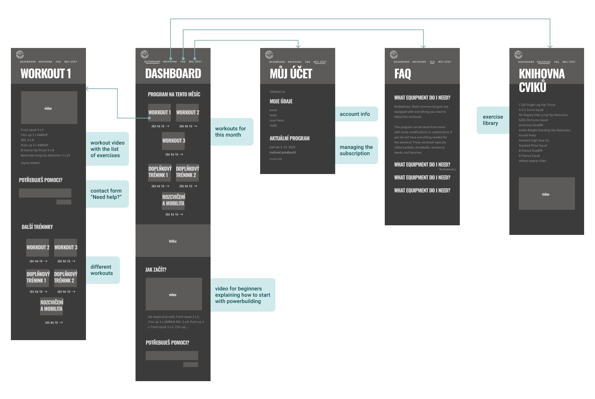
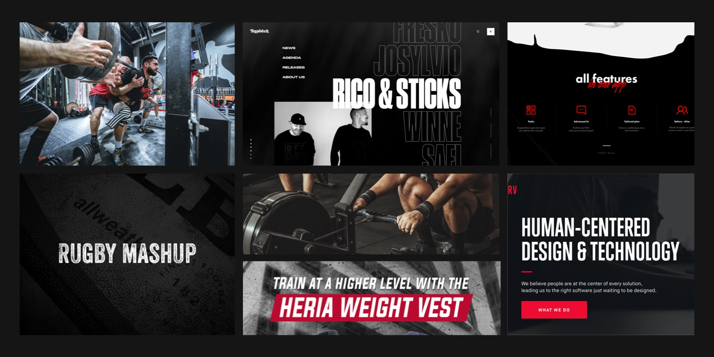

# Iron Warriors

<full-width color="#f3f8ff">

  

</full-width>

## Overview

Iron Warriors is a website presenting __the complete offer of a power building trainer__ Vašík. Its primary focus lies on online coaching, but you can also find information about in&#8209;person training, a blog or e&#8209;shop with his book and merchandise.

The client __asked us to redesign his website__ because his business has grown and broadened while the website got cluttered and __didn't reflect new business goals__. The project was realized by a digital agency MarketSoul.

  

    <h4>My Roles</h4>
    
Research, UX&nbsp;Design, UI&nbsp;Design, Prototyping

  

  

    <h4>Tools</h4>
    
Sketch, InVision, Overflow

  

<full-width color="#f3f8ff">
  

  ## Research

  ### Understand users
  
  The target group for this project consists of __sports-orientated men in the 18–30 age range who want to improve their physical strength__. To understand them better, I interviewed a couple of them and noticed a pattern in their opinions.
  
  

    

      

        
      

      

          <h4>The site is confusing; it’s hard to navigate and find out what it’s suitable for them</h4>
          <h4>They work out in a gym by themselves or with a mobile app</h4>
          <h4>The appearance of the site looks too dull and unmotivating according to them</h4>
      

    

  

  ### Project Goals
  I combined the research result, the analytics from the old website and client’s business goals to define the project goals.
  
  

  

    

      <h4>To present a wide variety of services in a clear way</h4>
    

    

      <h4>To create a platform for online coaching based on subscription</h4>
    

  

  
  

    

      <h4>To design mobile‑first</h4>
    

    

      <h4>To add rougher and more masculine mood</h4>
    

  

  

  

</full-width>

## Design a Solution

### Sitemap

With the project goals and users in mind, I sorted the content and added notes and ideas as it is shown in the simplified and detailed sitemap.

  

    

      <h4>Simplified Sitemap</h4>
      

        
      

    

    

      <h4>Detailed Sitemap</h4>
      

        
      

    

  

### Wireframes

Using the sitemaps, I created wireframes and wireflows, where I explored the layout and made sure the experience is fluid and intuitive.

<full-width color="#f3f8ff">
  

  ## Visual Design

  ### Moodboard
  

  

</full-width>
